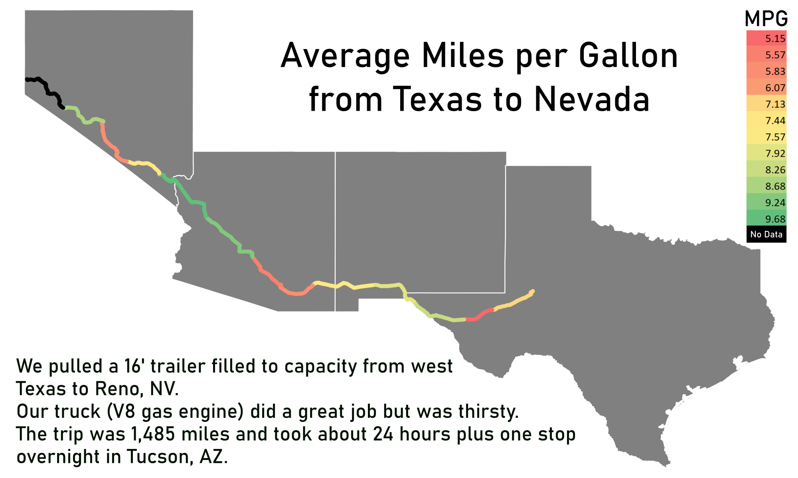

# Map-of-MPG-while-moving
 I used Google location history to map our truck's mpg during our move from Texas to Nevada.  The truck was pulling a 16' trailer packed to the gills.
 
 The mpg took a hit in Texas most likely because the speed limit is so high and the terrain actually pretty mountainous before El Paso.  In Nevada we hit a big windstorm and were lucky to get 5 mpg. It was pretty windy in Southern Arizona as well.
 
 Final product:
 
 

